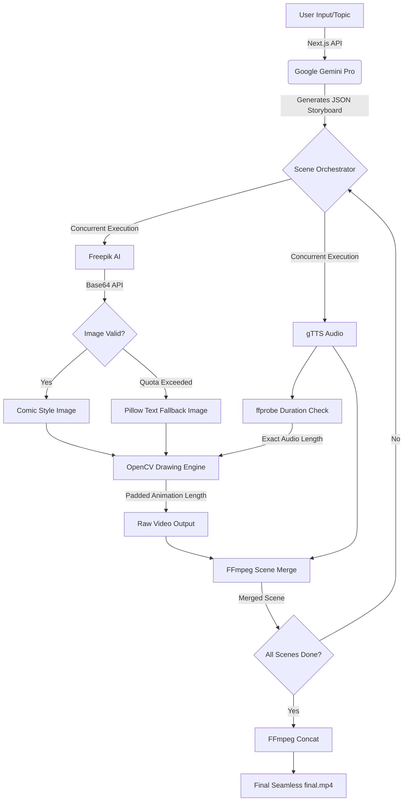

# 🎥 Darpan-ai दर्पण: AI Whiteboard Explainer Generator

Darpan-ai is an autonomous, full-stack pipeline that transforms any text, URL, or idea into a professional whiteboard animation video. It mimics a high-end production studio by automatically handling storyboarding, visual generation, hand-drawn animation, and voiceover orchestration.


## 📺 Live Demo
Watch Darpan-ai turn raw concepts into a continuous, perfectly synchronized 2D animated whiteboard video:

<video width="100%" controls>
  <source src="./Content%20to%202D%20whiteboard%20animation%20video.mp4" type="video/mp4">
  Your browser does not support the video tag. <a href="./Content%20to%202D%20whiteboard%20animation%20video.mp4">Download the demo video here.</a>
</video>

## 🚀 The Monolithic AI Video Pipeline

Darpan-ai utilizes a highly optimized **Monolithic Full-Video Architecture** to ensure zero playback gaps, flawless audio synchronization, and native HTML5 video player support. 

Instead of buffering scenes on the fly, the Node.js backend acts as a highly concurrent master orchestrator that generates all assets, compiles them, and serves a perfect, unified `.mp4` file.



### 🧠 Step-by-Step Architecture:
1.  **🤖 Storyboard Generation**: Google Gemini 1.5 processes the user's prompt and outputs a JSON array containing visual metaphors (prompts) and detailed narrations for multiple continuous scenes.
2.  **🎨 Visual Synthesis (Concurrent)**: The server concurrently requests images from the high-speed **Freepik AI API** (forcing a consistent "comic" drawing style). If the Freepik rate limit is hit, the system automatically falls back to a custom **Python Pillow script** to generate clean text-based slides, ensuring 100% uptime.
3.  **🎙️ Voiceover & Timing**: `gTTS` generates human-like narration. The system then uses `ffprobe` to determine the exact millisecond duration of the audio.
4.  **✍️ Dynamic Whiteboard Animation**: An OpenCV Python script simulates a hand-drawn effect. Crucially, the drawing time is mathematically locked to the exact audio duration **+ 2 seconds of padding**. This ensures the audio never cuts off and the user has time to view the final sketched image before the next scene.
5.  **🎞️ FFmpeg Stitching**: FFmpeg merges the audio and video streams for each scene without truncating the padded video length. Finally, `ffmpeg concat` natively stitches all scenes into one perfectly smooth `final.mp4` file.

## 💎 Key Features

-   **Native Seamless Playback**: By compiling everything into one master file on the backend, the player features a single global timeline slider, play/pause controls, and zero frame drops or audio stuttering.
-   **Download Support**: Easily download the final compiled `.mp4` directly from the dashboard.
-   **Intelligent Analogy Engine**: Transforms complex, dry topics into visual, easy-to-understand explanations.
-   **Robust Error Handling**: If external image APIs fail or exhaust their quota, the system instantly generates aesthetic text-based slides instead of crashing.
-   **Premium Dark UI**: A stunning glassmorphism interface built for modern creators.

## 🛠️ Tech Stack

-   **Frontend/Backend**: [Next.js 14](https://nextjs.org/) (App Router)
-   **AI Intelligence**: [Google Gemini 1.5](https://ai.google.dev/) (Storyboarding)
-   **Image Generation**: Freepik AI API (Primary) + Pillow (Fallback)
-   **Video Engine**: Python 3.10+ + [OpenCV](https://opencv.org/)
-   **Audio Engine**: Python + [gTTS](https://pypi.org/project/gTTS/)
-   **Processing**: [FFmpeg](https://ffmpeg.org/) (System Level Orchestration)

## 🚀 Getting Started

### 1. Prerequisites

-   **Python 3.10+**: Required for animation, Pillow fallbacks, and audio scripts.
-   **FFmpeg**: Must be installed and added to your System PATH (required for `ffprobe` and `ffmpeg`).
-   **Node.js 18+**: For the Next.js environment.

### 2. Setup Environment

Create a `.env.local` file in the root directory:
```env
GEMINI_API_KEY=your_gemini_api_key_here
FREEPIK_API_KEY=your_freepik_api_key_here
MONGODB_URI=your_mongodb_connection_string
```

### 3. Install Dependencies

```bash
# Install Node dependencies
npm install

# Install Python dependencies
pip install opencv-python numpy gTTS pillow
```

### 4. Run the Platform

```bash
npm run dev
```
Open `http://localhost:3000` in your browser. Enter a prompt, sit back, and watch the platform orchestrate an entire production studio!

## 📝 License

This project is licensed under the MIT License - see the LICENSE file for details.
